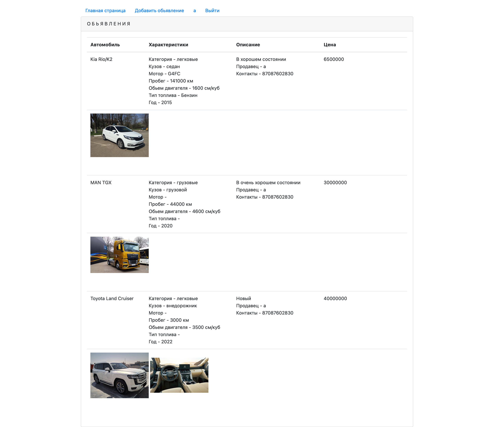
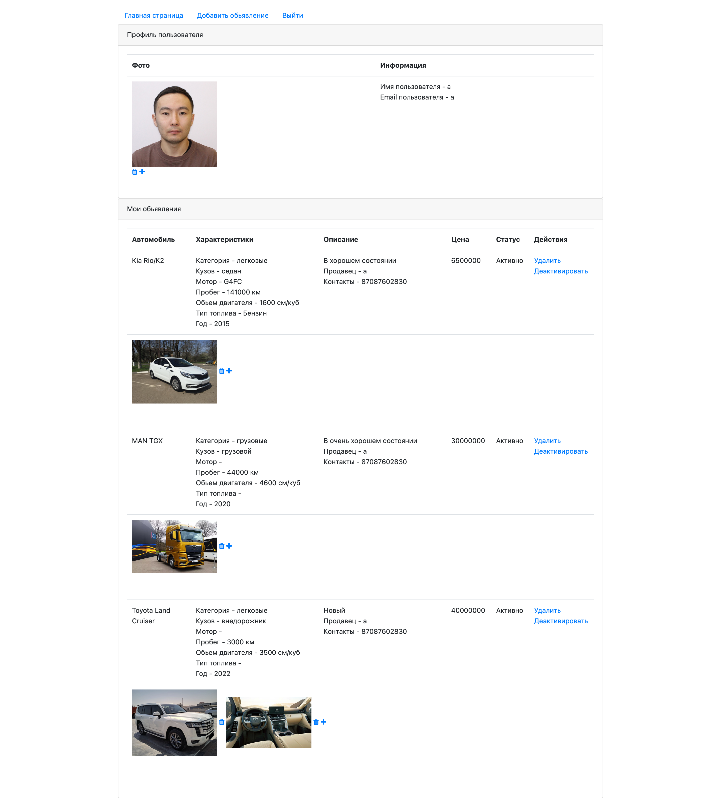
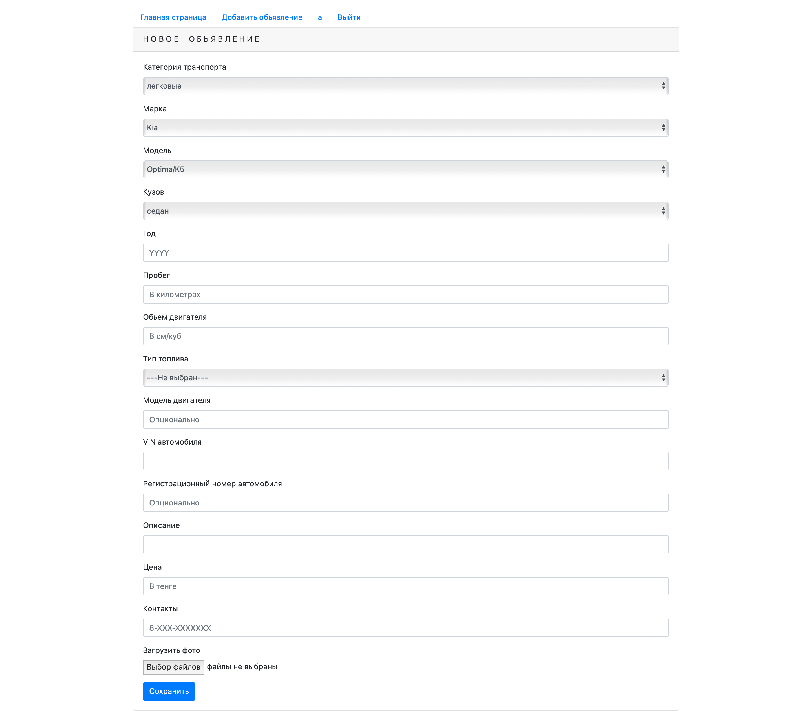
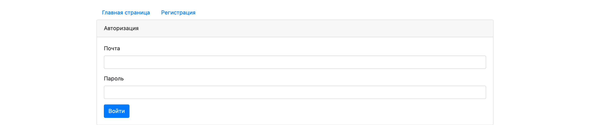
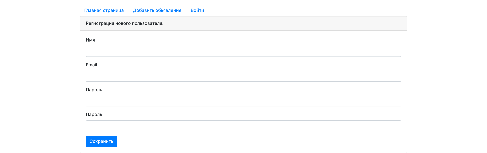

++++++++++++++++++++++++++++job4j_cars++++++++++++++++++++++++++++++
+++++++++++++++++++++++++++job4j project++++++++++++++++++++++++++++
++++++++++++++++++++++++Oryngali Karimzhan++++++++++++++++++++++++++

This project is a simple version of car selling website with the abilities to add, delete car selling posts,
change their selling statuses, and images to the posts.

Here are main technologies, that i used:
-JDK14, 
-Maven, 
-Java Servlets, 
-HTML, 
-Bootstrap, 
-JQuery(+Ajax), 
-JavaScript, 
-JSP(+JSTL), 
-PostgreSQL, 
-Hibernate ORM(HQL+Criteria API)
-Tomcat Server

All active posts page 

User page. User can redact(add/delete image, change selling status) or delete his posts.

Creating new post

Authorization

Registration

